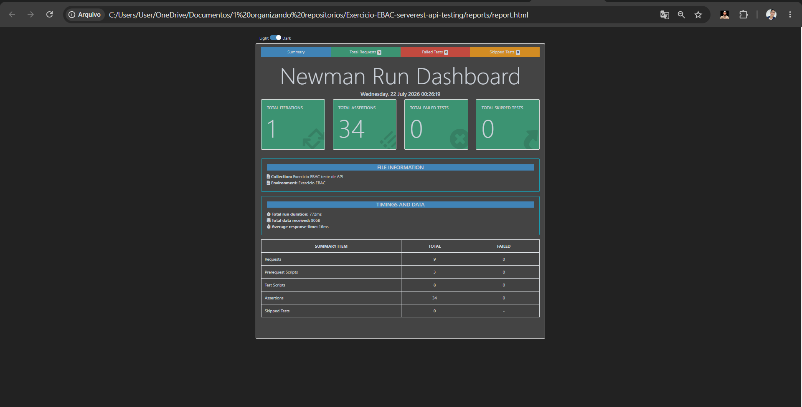

# Testes de API — ServeRest (Usuários)

Testes automatizados de API REST para o recurso **Usuários** do [ServeRest](https://serverest.dev/), API pública que simula um e-commerce, usada como referência de prática em automação de testes.

Projeto desenvolvido como exercício do módulo de testes de API da formação EBAC.

---

## Cobertura de testes

**Positivos (5)**
- Listar todos os usuários
- Cadastrar usuário (com dados aleatórios)
- Buscar usuário por ID
- Atualizar usuário (com dados aleatórios)
- Deletar usuário

**Negativos (3)**
- Email duplicado
- Dados inválidos (campo obrigatório faltando)
- ID inexistente

**Validações aplicadas em cada request:** status code, corpo da resposta, tipos de dados, mensagens de erro e tempo de resposta (< 300ms).

> Escopo: cobertura completa do CRUD do recurso `/usuarios`. Os demais recursos do ServeRest (`/produtos`, `/login`, `/carrinhos`) não fazem parte deste exercício.

---

## Stack técnica

- **Postman** — criação e organização da collection
- **Newman** — execução via linha de comando e geração de relatório
- **newman-reporter-htmlextra** — relatório HTML navegável
- **ServeRest** — API alvo, rodando localmente via `npx serverest`

---

## Estrutura do projeto

```
├── collections/
│   └── Exercicio EBAC teste de API.postman_collection.json
├── environments/
│   └── Exercicio EBAC.postman_environment.json
├── reports/                 # Relatório HTML gerado pelo Newman (git-ignored)
└── package.json
```

---

## Como executar

Pré-requisito: Node.js 18+

```bash
# 1. Instalar dependências (Newman, reporter e ServeRest)
npm install

# 2. Rodar tudo com um único comando:
# sobe o ServeRest local, espera a API responder, executa a collection via Newman
# e encerra o servidor ao final
npm test
```

O relatório HTML é gerado em `reports/report.html` — abra o arquivo no navegador para ver o resultado detalhado de cada request e asserção.

**Resultado da execução:**



### Rodando manualmente (opcional)

Se preferir subir o servidor e rodar a collection em terminais separados:

```bash
# Terminal 1 — sobe o ServeRest local em http://localhost:3000
npm run serverest

# Terminal 2 — executa a collection via Newman
npm run newman
```

### Rodando pelo Postman (interface gráfica)

1. Importe `collections/Exercicio EBAC teste de API.postman_collection.json`
2. Importe `environments/Exercicio EBAC.postman_environment.json`
3. Selecione o environment **"Exercicio EBAC"**
4. Suba o ServeRest local (`npx serverest`) e rode a collection pelo **Collection Runner**

---

## Autor

**Gedeon Guerra** — QA Engineer  
[GitHub](https://github.com/gedeonguerra)